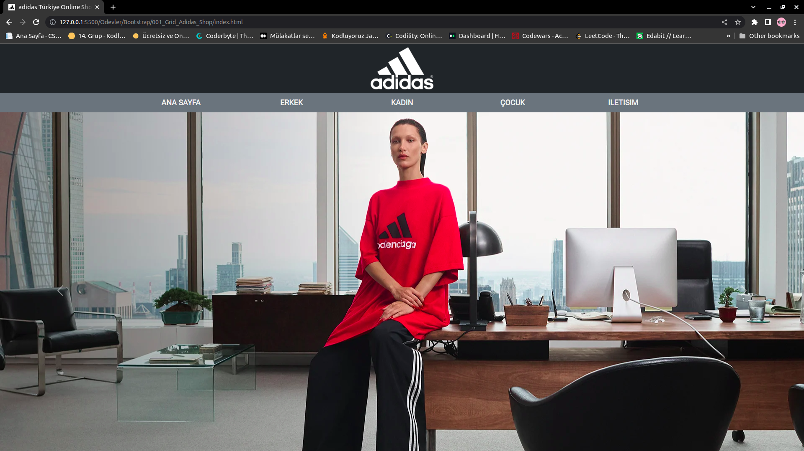
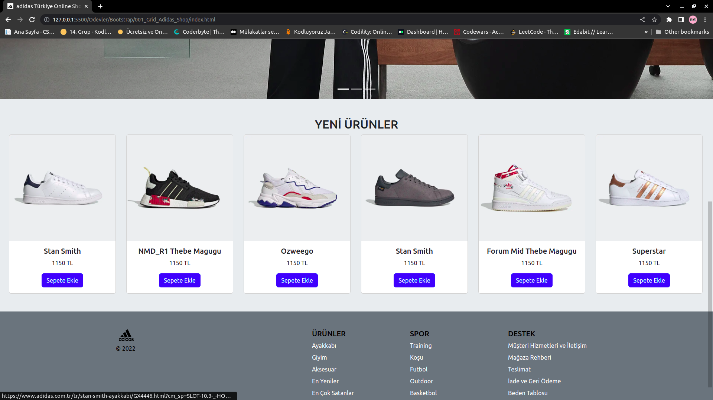
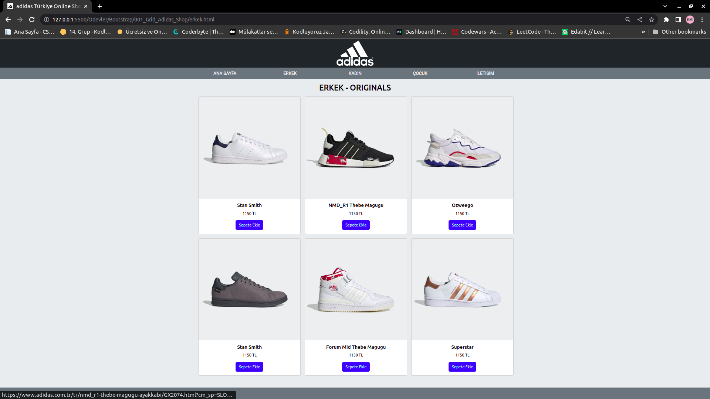
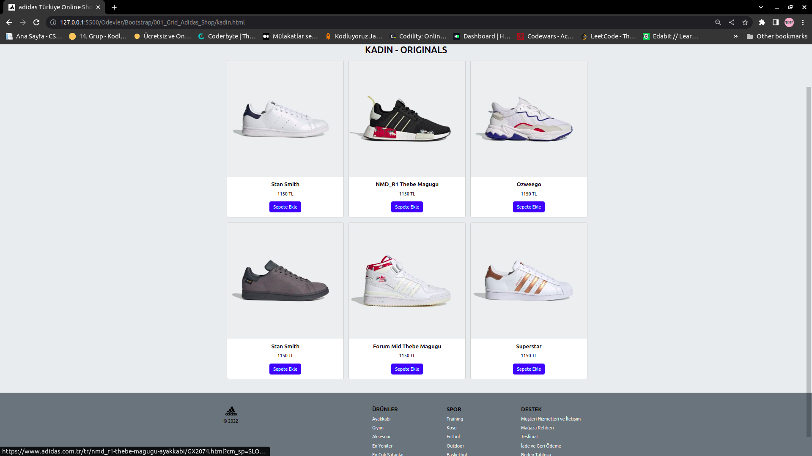
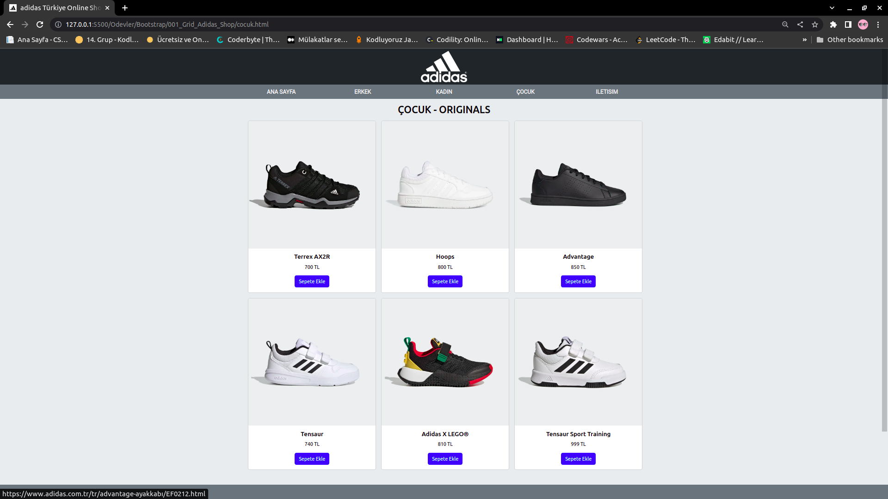
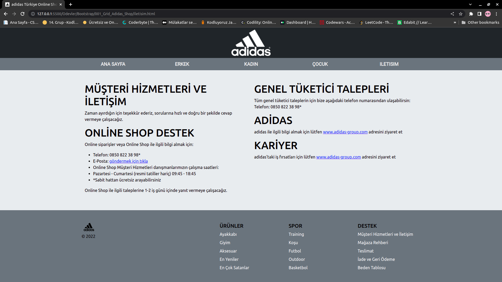

# Kodluyoruz Bootstrap Birinci Ödev Grid Sistemi ile Adidas Sitesinin Düzenlenmesi

Bu repo [Kodluyoruz](https://www.kodluyoruz.org) Front-End Eğitiminde oluşturduğumuz ilk repositories Bootstrap uygulamalarında birinci örnek. Adidas Türkiye için oluşturduğum alternatif sitenin grid sistemi ile container, row, col şeklinde düzenlenmesi ve bootstrap kullanımı.

***

***

***

***

***

## License
[MIT](https://choosealicense.com/licenses/mit/)