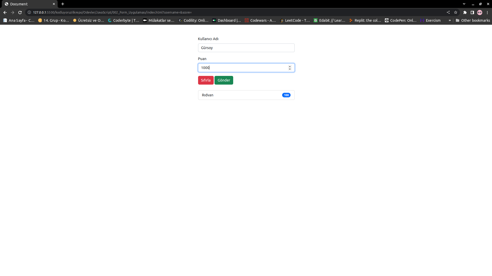
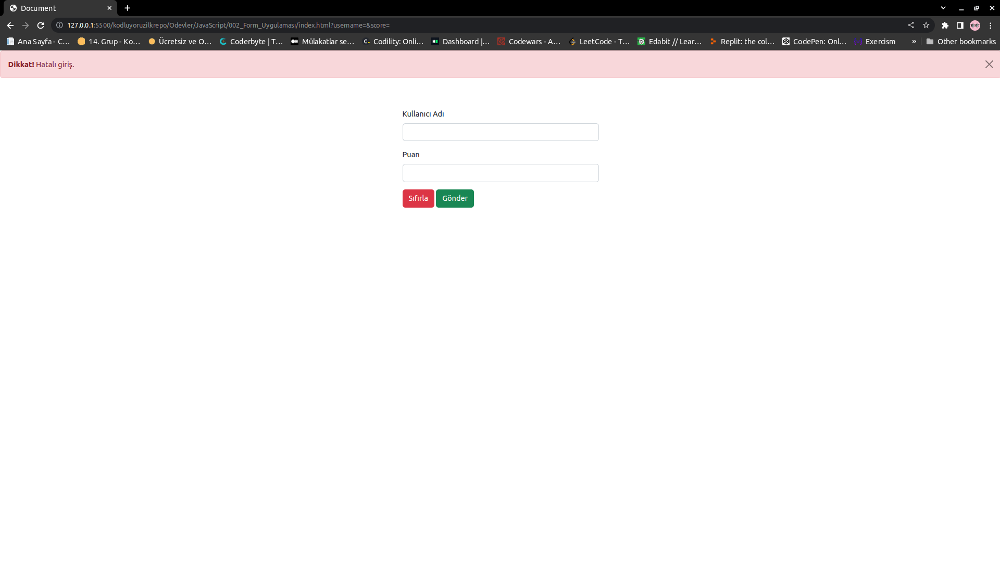

# Kodluyoruz JavaScript Form Uygulaması

Bu repo [Kodluyoruz](https://www.kodluyoruz.org) Front-End Eğitiminde oluşturduğumuz ilk repositories, JavaScript uygulamalarında form uygulaması. Kullanıcıdan isim ve skor alarak butona basıldığında listeye ekleme işlemi ve hatalı bir giriş yapıldığında uyarı veren bildirim uygulaması gerçekleştirildi.

## License
[MIT](https://choosealicense.com/licenses/mit/)