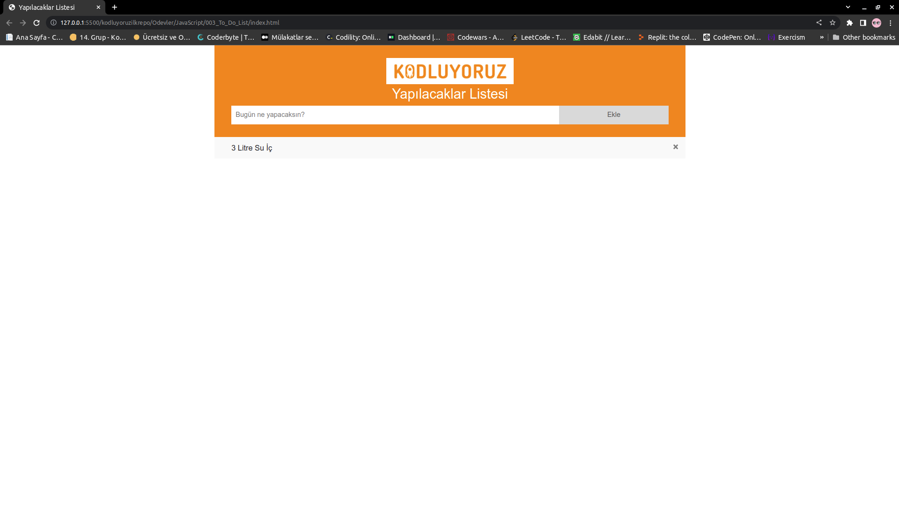

# Kodluyoruz JavaScript İkinci Ödev To Do List Yapımı

Bu repo [Kodluyoruz](https://www.kodluyoruz.org) Front-End Eğitiminde oluşturduğumuz ilk repositories, JavaScript uygulamalarında ikinci örnek. Günlük aktivitelerin yazılacağı to do list sitesi yapımı.

**Yapılan Aktivitelerin İşaretlenmesi**

***
**Listeye Yeni Aktivite Eklenmesi ve İşaretlenmesi**

***

**Aktivitelerin Silme Butonu ile Kaldırılması**

***

**Hatalı Boş Giriş Yapılıncı Çıkan Toast**

***

**Başarılı Giriş Yapınca Çıkan Toast**

***

## License
[MIT](https://choosealicense.com/licenses/mit/)