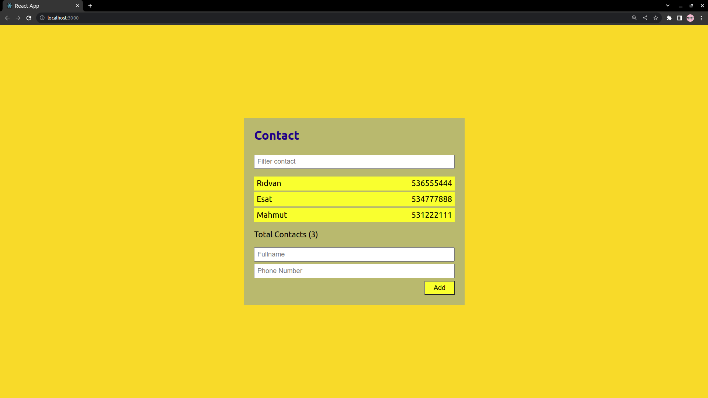
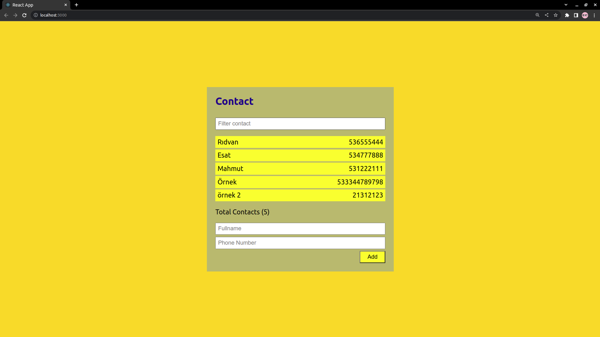
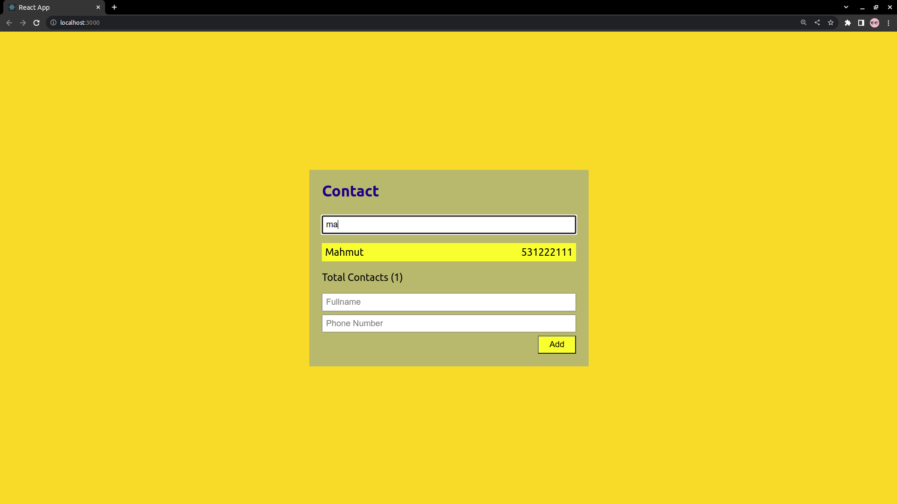

# Kodluyoruz React Örnek Uygulama
Bu repo Kodluyoruz Front-End Eğitiminde oluşturduğumuz ilk repositories ve React uygulamalarında ikinci örnek.

Bu uygulamada isim ve telefon numarasının girildiği iki tane input tanımlandı. Tanımlanan inputlara veri girildiğinde hemen üstünded listelenecek bir alan oluşturuldu. Oluşan listeyi filtrelemek içinde bir veri girişi için bir input oluşturuldu. 

Bu react uygulaması Form ve List şeklinde iki component ile tasarlandı. 

### 1) Genel Görünüm

### 2) Yeni Veri Girişi

### 3) Filtreleme

