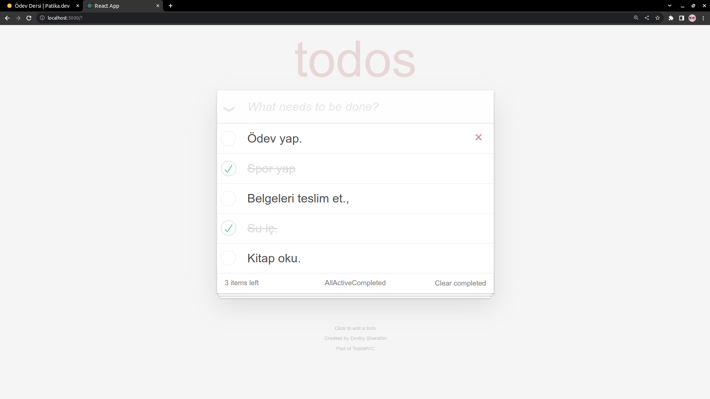

# Kodluyoruz React İkinci Ödev : To Do List
Bu repo Kodluyoruz Front-End Eğitiminde oluşturduğumuz ilk repositories ve React uygulamalarında ikinci ödev.

Bu örnekte günlük işlerimizin planlandığı to do list uygulamasını gerçekleştirdim. İnput' a yapılacak iş girildiğinde aşağıda listelenecek şekilde tasarlandı. Eğer iş tamamlandıysa başında bulunan tik işaretine tıklanarak işin tamamlandığı belirtilebilir. Ayrıca yanında çarpıya tıklanınca yapılacak iş silinebilir. 

Uygulamayı 4 ayrı componentle yapmayı uygun buldum. Header, section, footer, infoFooter. Ayrıca local storage kullanarak sayfa yenilenmelerinde veri kaybının önüne geçtim.

### 1) Projenin Genel Görünümü

