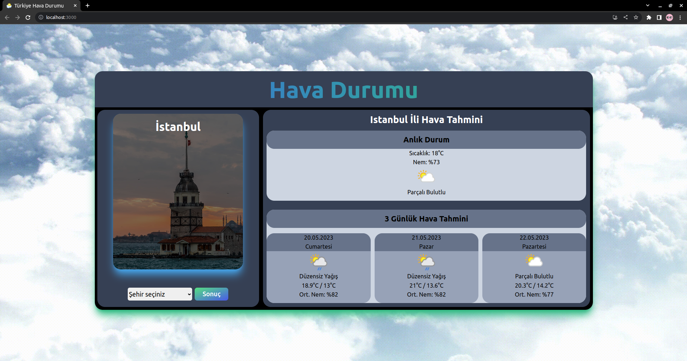
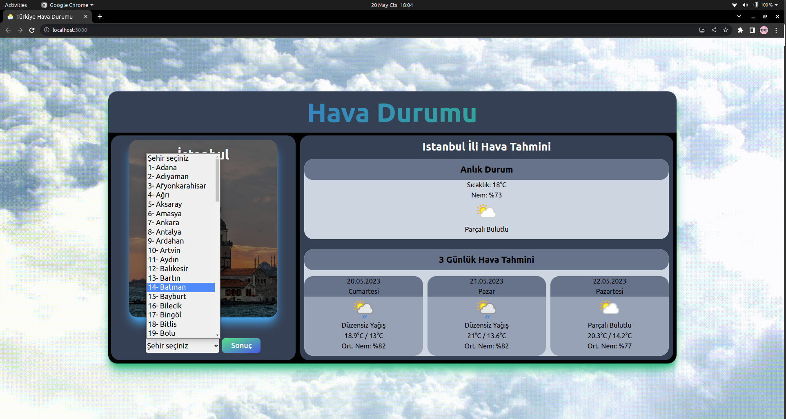
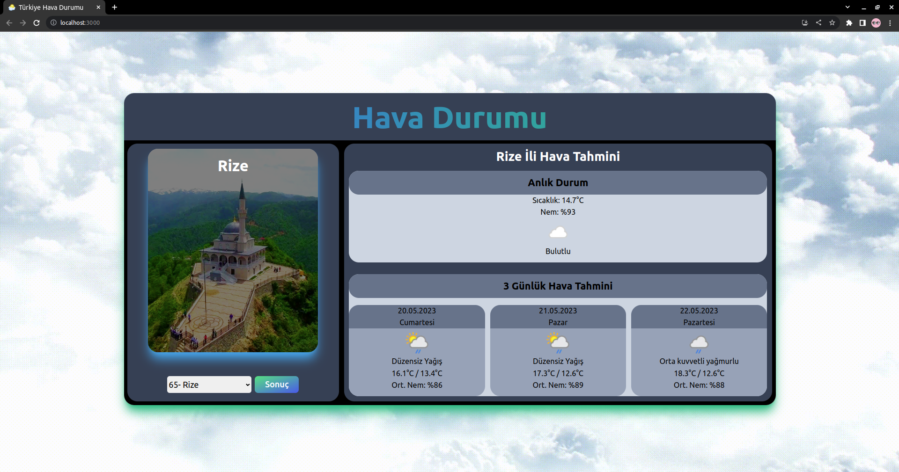
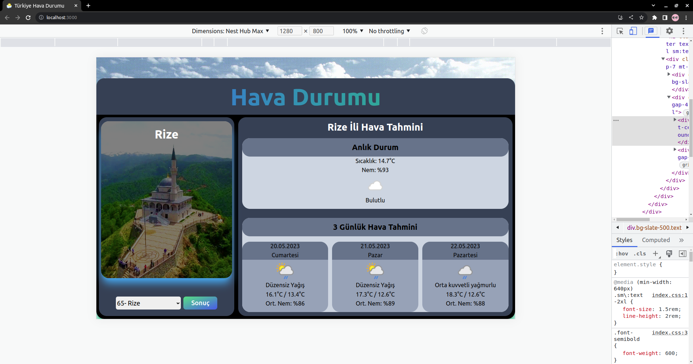
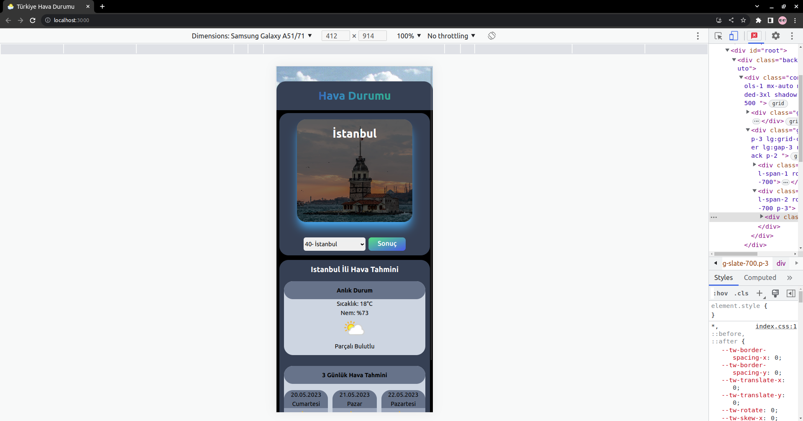
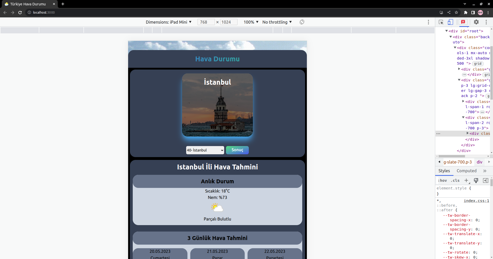

# Kodluyoruz React Üçüncü Ödev : Hava Durumu Uygulaması

Bu repo Kodluyoruz Front-End Eğitiminde oluşturduğumuz ilk repositories ve React uygulamalarında üçüncü ödev.

Bu örnekte günlük hava durumu bilgisi ve 3 günlük hava durum tahmini uygulamasını gerçekleştirdim. Uygulama sadece Türkiye' nin illerini içermektedir.

### Bilgiler

1. Uygulama, Context API kullanılarak geliştirilmiştir.
2. Hava raporunda görüntülenen veriler tamamen gerçeği yansıtmaktadır. Hava durum bilgilerine erişmek için [weatherapi](https://www.weatherapi.com/ "WeatherApi Homepage") API kullanılmıştır.
3. Hava raporu, içinde bulunduğumuz günden başlayarak önümüzdeki üç günlük süreci yansıtmıştır.
4. Sayfa ilk açıldığında varsayılan olarak İstanbul şehrinin hava durumunu gösterilmektedir.
5. Günlerin listelendiği kartlarda; gün adı, hava durumu görseli (güneşli, yağmurlu, karlı, parçalı bulutlu), en yüksek ve en düşük sıcaklık gösterilmektedir.
6. Bir dropdown aracılığı ile farklı bir şehrin hava raporuna ulaşılabilmektedir.
7. Uygulama React ve tailwind ile geliştirildi.
8. Responsive bir tasarım gerçekleştirildi.
9. 81 ilin meşhur yerleri, şehir seçildiği anda gösterilecek bir tasarım düşünüldü.
10. Uyguluma 3 adet "CityPhotoCard.js , CitySelector.js , WeatherCard.js" component ile oluşturuldu.
11. Ayrıca 1 adet "WeatherContext.js" context kullanıldı.

### 1) Projenin Genel Görünümü

### 2) Projenin Responsive Görünümü

### Uygun Scriptler

Proje klasörünün içerisinde aşağıdaki komut ile uygulamayı çalıştırabilirsiniz:

### `npm start`

## License

[MIT](https://choosealicense.com/licenses/mit/)
