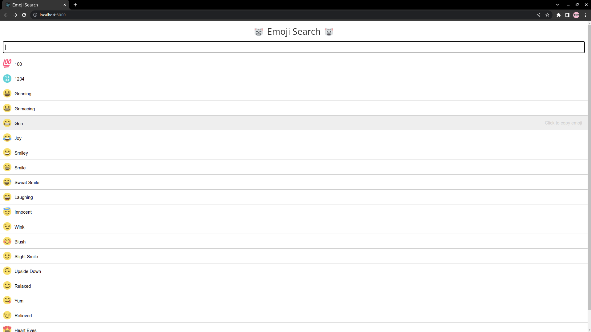
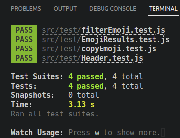

# Kodluyoruz React Dördüncü Ödev : Emoji Arama Uygulaması İçin Test Dosyalarının Hazırlanması

Bu repo Kodluyoruz Front-End Eğitiminde oluşturduğumuz ilk repositories ve React uygulamalarında dördüncü ödev.

Bu örnekte React'ın kendi dokümanlarında paylaşılan örnek projerde bulunan ve halihazırda çalışan emoji arama uygulamasının test kodları yazılmıştır. Test kodlarına [test](https://github.com/rdvngrsy/kodluyoruzilkrepo/tree/main/Odevler/React/005_odev_4/src/test)  klasöründen ulaşabilirsiniz.

Uygulama üzerinde bazı emojiler listeleniyor ve input aracılığı ile listelenen emojiler filtrelenebiliyor.

### Test Dosyaları İçin Gereksinimler

1. Başlık kısmının başarılı bir şekilde render edildiğini kontrol edecek olan test kodunu yazın. ([Header.test.js](https://github.com/rdvngrsy/kodluyoruzilkrepo/tree/main/Odevler/React/005_odev_4/src/test/Header.test.js))
2. Uygulama ilk açıldığında emoji listesinin başarılı bir şekilde render edildiğini kontrol edecek olan test kodunu yazın. ([EmojiResults.test.js](https://github.com/rdvngrsy/kodluyoruzilkrepo/tree/main/Odevler/React/005_odev_4/src/test/EmojiResults.test.js))
3. Bir filtreleme işlemi yapıldığında, emoji listesinin bu filtreye uygun şekilde yeniden render edildiğini kontrol edecek olan test kodunu yazın. ([FilterEmoji.test.js](https://github.com/rdvngrsy/kodluyoruzilkrepo/tree/main/Odevler/React/005_odev_4/src/test/FilterEmoji.test.js))
4. Liste üzerinden herhangi emojiye tıklandığında, ilgili emojinin kopyalandığını kontrol edecek olan test kodunu yazın. ([CopyEmoji.test.js](https://github.com/rdvngrsy/kodluyoruzilkrepo/tree/main/Odevler/React/005_odev_4/src/test/CopyEmoji.test.js))

### 1) Projenin Genel Görünümü

### 2) Projenin Test Sonuçları

### Uygun Scriptler

Proje klasörünün içerisinde aşağıdaki komut ile uygulamayı çalıştırabilirsiniz:

### `npm start`

## License

[MIT](https://choosealicense.com/licenses/mit/)