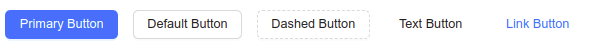

# Kodluyoruz React Beşinci Ödev : Buttons Custom Hook Uygulaması
## :red_circle: [Görüntülemek için tıklayın.](https://www.npmjs.com/package/button-user?activeTab=readme) ↗
Bu repo Kodluyoruz Front-End Eğitiminde oluşturduğumuz ilk repositories ve React uygulamalarında beşinci ödev.

Bu örnekte custom hook ile Button componentleri oluşturdum. Ardından npmjs sitesinde yaptığım hook' u publish ettim. 

### Gereksinimler

1. Button bileşenine geçilecek olan "type" prop'u ile button'un tipi değişmelidir. (primary, default, dashed, text, link)
2. İlgili component npmjs.com üzerinde paylaşılmalı ve indirilebilir olmalıdır.

### 1) Projenin Genel Görünümü

### Uygun Scriptler

Proje klasörünün içerisinde aşağıdaki komut ile uygulamayı çalıştırabilirsiniz:

### `npm start`

## License

[MIT](https://choosealicense.com/licenses/mit/)